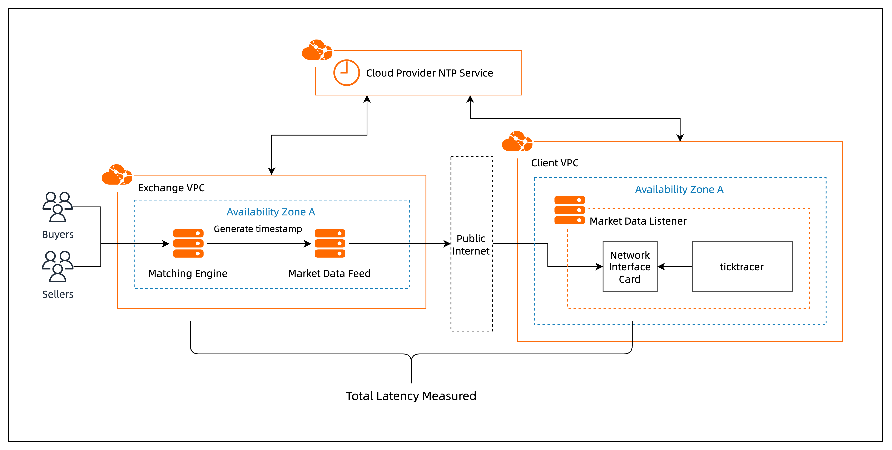

# ticktracer
`ticktracer` is a simple Python application that allows you to trace your latency to crypto exchanges, and was developed to run on Alibaba Cloud ECS and analyze the shortest latency for exchanges hosted on Alibaba Cloud. However, any cloud provider can be used.

 When the machine running `ticktracer` and the target exchange use the same NTP service, we can safely assume that the any clock skew between the two instances is negligible. If your instance has `chronyc` installed, you can verify the time synchronization status of the machine through the command `chronyc sources`.

Currently only websocket data feed latency can be extracted. It works by establishing a websocket connection to a crypto exchange API endpoint, decrypting the session with Wireshark, and comparing the arrival timestamp of packets with the payload timestamps provided by the exchange itself. Packet timestamps are received by `libpcap` from the kernel and are not generated by `ticktracer` itself, unlike other projects. See [here](https://wiki.wireshark.org/Timestamps) for more information.


### Supported Exchanges
- Binance
- Bybit
- OKX

## Requirements
Ticktracer has been tested on the following operating systems:
- macOS >= 14.0
- Debian >= 12.0
- Ubuntu >= 22.0

In addition, the following external dependencies are required:
- `wireshark` or `tshark` >= 4.0.7
- `libssl-dev` for Debian-based systems or `openssl` for MacOS

## Installation
### MacOS
Install with [Homebrew](https://brew.sh/).
```
brew install wireshark openssl
python3 -m pip install ticktracer
```
### Linux
Install with `apt`.
```
sudo apt update && sudo apt install -y tshark libssl-dev
python3 -m pip install ticktracer
```
Optionally, you can install `ticktracer` with [pipx](https://github.com/pypa/pipx) instead of pip to automatically create a Python virtual environment in which it will run:
```
sudo apt install pipx
pipx ensurepath
pipx install ticktracer
```
Note that Wireshark requires the user to either have root privileges or to be part of the `wireshark` group in order to trace packets. To enable non-root access to wireshark, run the following command and select `yes`:

`sudo dpkg-reconfigure wireshark-common`

 To add your user to the `wireshark` group, run the following command:

`sudo adduser <YOUR-USER> wireshark`

Create a new session in your terminal, and verify that you are part of the `wireshark` group with the following  command:

`groups`


## Usage
```
usage: ticktracer [-h] -e EXCHANGE -p PAIR -d DURATION [-i INTERFACE]

options:
  -h, --help            show this help message and exit
  -e, --exchange_id {okx,binance,bybit}
                        The exchange to connect with.
  -p, --pair PAIR       The trading pair to monitor. Look up the specific format on the exchange's API documentation.
  -d, --duration DURATION
                        Duration in seconds to monitor.
  -i, --interface INTERFACE
                        The network interface to listen on. Default is eth0 for Linux or en0 for macOS.
```
Example: `ticktracer -e okx -p BTC/USDT -d 60`

After the monitoring duration has elapsed, the script will output the latency in milliseconds across different percentiles:
```
Total samples taken: 11567
Latency report:
+------------+-------------------------+
| Percentile | Latency in milliseconds |
+------------+-------------------------+
|    MIN     |          3.104          |
|    25%     |          9.151          |
|    50%     |          10.401         |
|    75%     |          11.762         |
|    90%     |          13.08          |
|    95%     |          14.102         |
|    99%     |          19.474         |
|   99.9%    |          32.975         |
|    MAX     |          48.023         |
+------------+-------------------------+
```